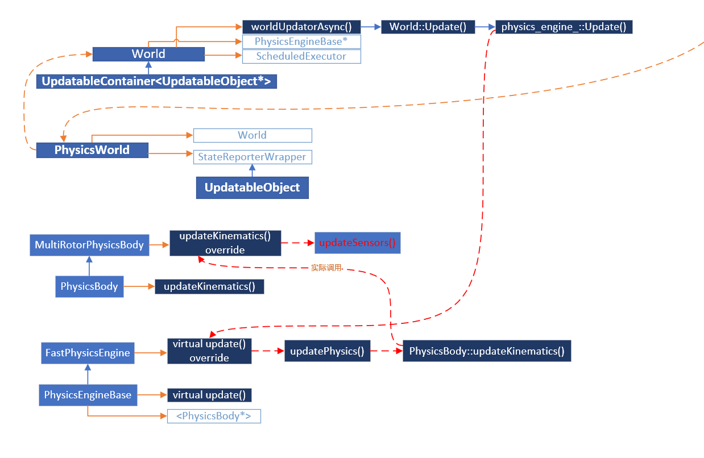

# 如何执行的传感器更新命令
对于`ASimModeBase`类，他应该需要调用`PawnSimApi::pawnTick(float dt)`来执行`PawnSimApi::update()`的操作。`PawnSimApi::update()`在不同的派生类中被重写，因此实际上执行的`update()`是子类的`update()`。
`PawnSimApi::pawnTick(float dt)`的实现形式是：
```cpp
    void PawnSimApi::pawnTick(float dt)
    {
        //default behavior is to call update every tick
        //for custom physics engine, this method should be overridden and update should be
        //called from every physics tick
        update();
        updateRenderedState(dt);
        updateRendering(dt);
    }
```
## 轮式车辆的传感器数据更新
轮式车辆所对应的`PawnSimApi`派生类是`CarPawnSimApi`，其`update()`的具体形式是
```cpp
//physics tick
void CarPawnSimApi::update()
{
    pawn_api_->update();

    PawnSimApi::update();
}
```
可见，它相当于执行了`pawn_api_->update()`，其代码为：
```cpp
void CarPawnApi::update()
{
    vehicle_api_->updateCarState(getCarState());
    vehicle_api_->update();
}
```
这一部分的`vehicle_api_->update();`就是在更新传感器的数据：
```cpp 
   // CarApiBase.cpp
    virtual void update() override
    {
        VehicleApiBase::update();

        getSensors().update();
    }
```
所以，`PawnSimApi::pawnTick(float dt)`的执行频率和传感器数据更新频率是一致的。而对于AirSim Unreal Plugin，其仅在一个地方被调用，即在`PawnSimApi::initialize()`中的末尾：
```cpp
    // PawnSimApi::initialize()

    params_.pawn_events->getPawnTickSignal().connect_member(this, &PawnSimApi::pawnTick);
```
而这个信号是由`void ACarPawn::Tick(float Delta)`所唯一发出：
```cpp
    void ACarPawn::Tick(float Delta)
    {
        Super::Tick(Delta);

        /*blah... .*/
        pawn_events_.getPawnTickSignal().emit(Delta);
    }
```
由于其Tick的定义是重写的，因此调用基类`AActor::Tick`的时候就会调用该函数`virtual void Tick(float Delta) override;`。在Unreal的官方文档中，对`AActor::Tick`的定义是：

> **Function called every frame on this Actor**. Override this function to implement custom logic to be executed every frame. Note that Tick is disabled by default, and you will need to check PrimaryActorTick.bCanEverTick is set to true to enable it.

也就是说，**这里的传感器更新的频率和帧更新频率是相同的**。这就会出现一个问题，就是帧与帧之间的时间是不同的，因此采样的间隔貌似也会不一样。
这也说明一点，在AirSim中，并没有对车辆的物理模型进行建模，而是直接调用的`Unreal`的四轮车模型。

## 多电机无人机（四旋翼）的传感器数据更新
对于电机无人机`MultirotorPawnSimApi`，它直接重写了`PawnSimApi::pawnTick(float dt)`，然而里面却没有任何实现：
```cpp
    void MultirotorPawnSimApi::pawnTick(float dt)
    {
        unused(dt);
        //calls to update* are handled by physics engine and in SimModeWorldBase
    }
```
因此，对无人机来说，它就完全不会利用每一帧去更新它的状态和传感器数据。这里的注释说明了`update()`函数是通过`physicEngine`来实现的。

那么，`physicEngine`的`update()`究竟是如何调用到去更新传感器数据的呢？下面这张图可以帮助进行解释：



可以看出，这些与物理模型有关的资源本质上都是使用`PhysicsWorld`来进行管理的。它管理着`World`类就包含了一个`PhysicsEngineBase`。在这个`PhysicsEngineBase`里面，拥有者所有带有物理引擎的物理实体`PhysicsBody`。对于目前版本的AirSim，带有物理引擎的对象就是四旋翼。在AirSim启动后，`PhysicsWorld`会对所有资源进行初始化，然后会调用`World.SheduledExcutor`组件，开启一个线程，周期性地执行`World::worldUpdatorAsync()`，而这个函数会最终调用`PhysicsBody::updateKinematics()`。对于四旋翼，会调用其`updateSensors()`函数，对所有的传感器数据进行更新。

从这个流程来看，AirSim为我们提供了一个完整的框架。如果需要添加不同的物理实体，仅需添加不一样的`PhysicsBody`就行了，即便是使用车辆也是如此。

另外一个特点是，在`PhysicsEngine::update()`中，会对所有的物理实体进行更新，因此实现了所有物理实体状态的同步更新。如果有需要同时更新的测量，可以在这里得到统一的更新。

## 物理引擎驱动和非物理引擎驱动的实体之间的数据交换

从上面对不同实体的分析看出，两个不同实体更新传感器数据的策略是不同的。在目前看来，要想直接通过编程的方法来实现两者的统一，可能会面临一些问题。**不过两者在结构上是有相似性的，即都用`SensorCollection::update()`来进行传感器更新的。**那么一个显而易见的问题就是：`SensorCollection`里面会包含有所有物理实体的传感器吗?

### SensorCollection中是否包含所有的物理实体的传感器？
`SensorCollection`是一个物理实体就会有一个实例，而不是全局的。

如对于四旋翼，其`SensorCollection`的初始化是在`void MultirotorPawnSimApi::initialize()`中，利用` MultiRotorParamsFactory::createConfig(getVehicleSetting(), sensor_factory);`来完成的。
而对于车辆，就会利用`CarApiFactory::createApi()`来完成。（题外话，两者实现上其实是不一样的。一个是在创建api实例的时候就初始化，而另一个在`createConfig`完了以后才进行统一的初始化方法。）

`SensorCollection`的双层字典可能会让人疑惑，以为是针对不同的车辆，其实是针对不同的传感器类型。

## 最初的SimModeBase是如何初始化的？
最初，是由`void ASimHUD::createSimMode()`初始化的。其代码为：
```cpp
void ASimHUD::createSimMode()
{
    std::string simmode_name = AirSimSettings::singleton().simmode_name;

    FActorSpawnParameters simmode_spawn_params;
    simmode_spawn_params.SpawnCollisionHandlingOverride = ESpawnActorCollisionHandlingMethod::AdjustIfPossibleButAlwaysSpawn;

    //spawn at origin. We will use this to do global NED transforms, for ex, non-vehicle objects in environment
    if (simmode_name == "Multirotor")
        simmode_ = this->GetWorld()->SpawnActor<ASimModeWorldMultiRotor>(FVector::ZeroVector, 
            FRotator::ZeroRotator, simmode_spawn_params);
    else if (simmode_name == "Car")
        simmode_ = this->GetWorld()->SpawnActor<ASimModeCar>(FVector::ZeroVector,
            FRotator::ZeroRotator, simmode_spawn_params);
    else if (simmode_name == "ComputerVision")
        simmode_ = this->GetWorld()->SpawnActor<ASimModeComputerVision>(FVector::ZeroVector,
            FRotator::ZeroRotator, simmode_spawn_params);
    else {
        UAirBlueprintLib::ShowMessage(EAppMsgType::Ok, std::string("SimMode is not valid: ") + simmode_name, "Error");
        UAirBlueprintLib::LogMessageString("SimMode is not valid: ", simmode_name, LogDebugLevel::Failure);
    }
}
```
**这样的代码说明了一个问题，即是说一场游戏中，要么是出现汽车，要么是出现四旋翼。在多机器人系统中，要么出现全部是四旋翼，要么是全部的汽车。
**
# 对于UWB一类的需要同步的传感器更新的思路
基本思路是，在sensorupdate的时候，分两个情况，就是首先更新不用同步的传感器数据，然后再在所有的物理实体更新完后，更新同步传感器的数据信息。所以要做的事情有:

- [x] `sensorBase`中加入一个标志来确认该传感器类型是否为全局的传感器
- [ ] 编写UWB类传感器的初始化流程。（……）
- [ ] 编写`Virtual PhsicsBody::updateKinematicsEnd()`函数。
- [ ] 编写各个相关文件的`update()`函数，在这个过程中，注意它们可能会调用`updatebaleObject::update()`来说明在这个时间段自己是被更新过的。（但现在看来好像其中所使用的`updatebaleObject::updated`这个变量没有任何意义，所以暂时不用使用）